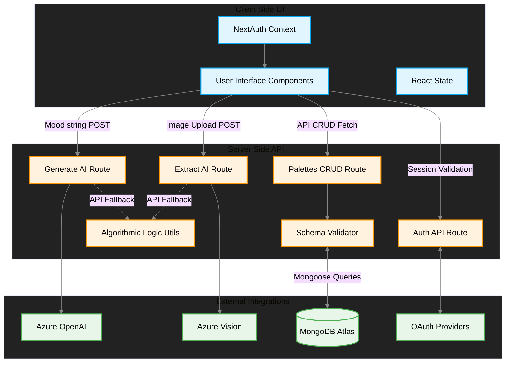
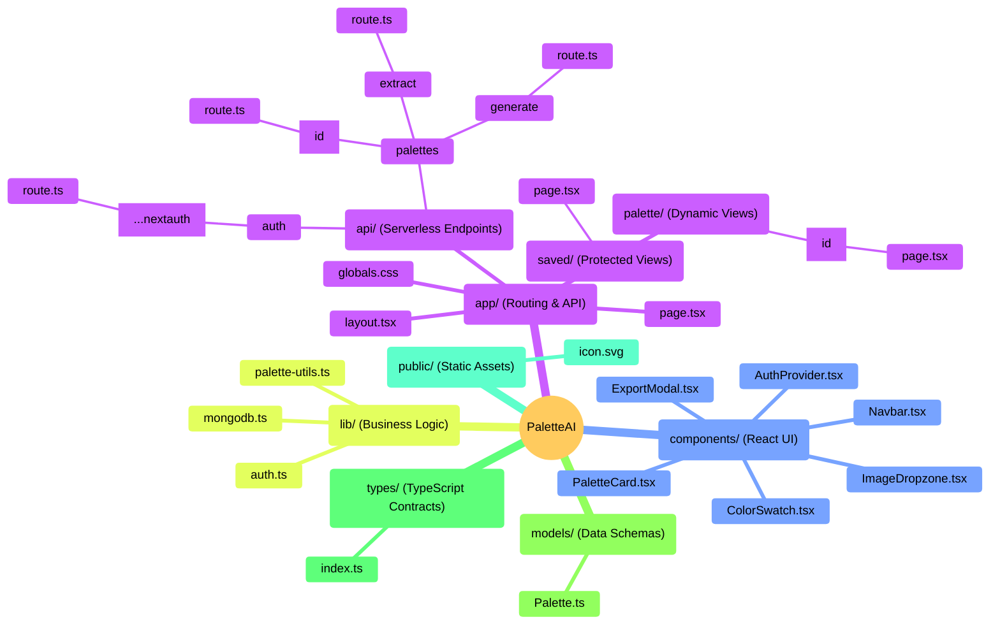
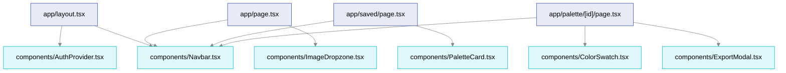
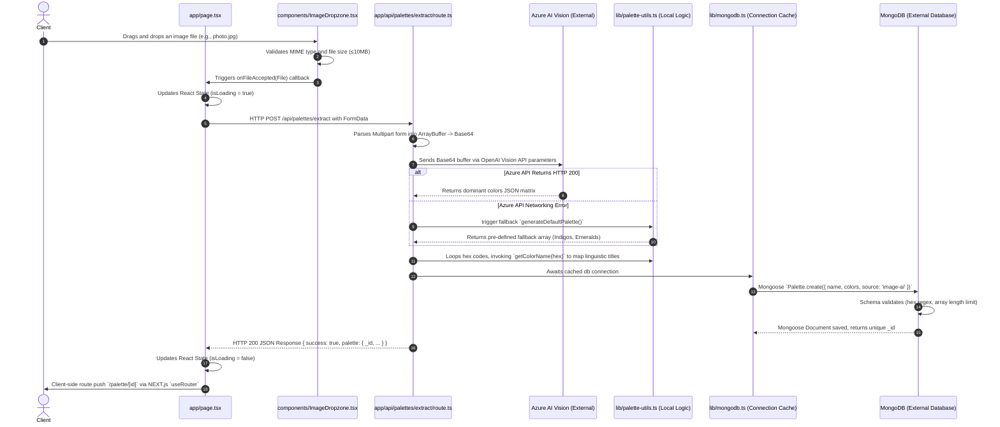

# PaletteAI - Comprehensive Architecture & Devlog

This document provides a highly detailed, engineering-focused exploration of the **PaletteAI** codebase. It outlines the architectural decisions, system components, routing structures, styling philosophy, AI prompt engineering, data management strategies, and the flow of data across the Next.js application, visualizing these relationships with comprehensive diagrams.

---

## 🏗️ 1. High-Level System Architecture

PaletteAI is a full-stack web application built on **Next.js 14+**. It leverages the modern **App Router** for rendering and fetching strategies (combining Server Components and Client Components). The backend logic is completely serverless, relying on Next.js API Routes (`app/api/*`) which connect directly to a cloud-hosted MongoDB cluster and Azure Cognitive Services.



---

## 📁 2. File and Directory Structure Overview

The codebase is strictly separated by concern, ensuring that the UI remains decoupled from database logic and third-party AI integrations.



---

## 🤖 3. Core Capabilities & AI Integrations

PaletteAI relies heavily on Next.js Route handlers acting as secure proxy servers to interface with Enterprise-grade AI endpoints.

### 3.1 Text-to-Palette Generation (`/api/palettes/generate/route.ts`)
When a user types a "mood" or a character name, it is processed through an Azure-hosted OpenAI deployment.

- **Prompt Engineering Strategy**:
  The system prompt is heavily localized to behave uniquely based on pop culture, moods, and abstract concepts. The system is instructed:
  > *"You are a world-class color palette designer. If the input is a CHARACTER NAME, think about that character's VISUAL IDENTITY (e.g., 'Satoru Gojo' = electric blue, ice white...)"*
- **Formatting Guarantees**:
  LLMs are notoriously bad at adhering to strict JSON without markdown formatting. The API route defensively parses the response:
  `content = content.replace(/^```(?:json)?\s*/i, '').replace(/\s*```$/i, '').trim();`
- **Temperature Constraints**: The API call sets `temperature: 0.3` to ensure highly deterministic, reliable outputs regarding color theory, rather than overly creative hallucinations.

### 3.2 Image-to-Palette Extraction (`/api/palettes/extract/route.ts`)
Instead of utilizing standard mathematical image processing (like k-means clustering or quantization algorithms, which often pick ugly or irrelevant background pixels), PaletteAI utilizes **Azure OpenAI Vision** to understand the *semantic* contents of an image to derive colors.

- **Form-Data Processing**: Images are uploaded from the client via `multipart/form-data`. The server buffer loads the `ArrayBuffer` into memory, converts it to a standard `base64` string (`data:${mimeType};base64,...`), and passes it to the `image_url` property of the vision model.
- **Vision Prompt Strategy**:
  The model is instructed: *"Extract ACTUAL colors visible in the image — sample from the most prominent areas... Include both foreground and background colors if they are prominent."*
- **Algorithmic Fallback**: If Azure experiences downtime, the system falls back to returning a default vibrant palette (using `generateDefaultPalette()`) so the user flow is not fundamentally broken.

---

## 🧩 4. Component Architectural Deep-Dive

### 4.1 The Dropzone UI (`components/ImageDropzone.tsx`)
The application requires an intuitive way for users to supply images.
- Built utilizing the popular `react-dropzone` library.
- **Constraints**: Enforces a strict `10 MB` max file size restriction (`maxSize: 10 * 1024 * 1024`), limiting memory bloat on the serverless API routes.
- **Supported Mimes**: Restricts to `.png`, `.jpg`, `.jpeg`, `.webp`, `.gif`, and `.bmp`.
- **Reactive UI**: Utilizes `isDragActive` to toggle a CSS module class (`styles.active`), providing immediate tactile feedback when dragging files over the UI window. It integrates `lucide-react` icons to visualize states.

### 4.2 Reusable UI Layer (The `components/` Directory)
To prevent CSS specificity issues, the application strictly uses **CSS Modules** conventions (e.g., `Component.module.css`).



- **`Navbar.tsx`**: A core sticky navigation bar. It utilizes `useSession()` from NextAuth.
- **`PaletteCard.tsx`**: A dashboard summary component expecting a `IPalette` object. It iterates over the `colors[]` array rendering small `<div>` squares utilizing inline styles.
- **`ColorSwatch.tsx`**: Features interactive state (`useState`, `onClick`) allowing the user to copy the hex code.
- **`ExportModal.tsx`**: Allows data egress.

---

## Core Server Logic & Mathematics (`lib/` and `models/`)

### 5.1 Database Reliability (`lib/mongodb.ts` & `models/Palette.ts`)
- **Schema Validation**: The Mongoose Schema enforces that `colors` Arrays must contain strictly between 2 and 10 items.
- **Sanitization**: All `hex` strings must match the rigorous regex `^#[0-9a-fA-F]{6}$`. This prevents malformed data from breaking downstream SVG or CSS generators.
- **Indexing Strategy**: Exports indexes on `createdAt: -1` and compounded text indexes on `{ mood: 'text', name: 'text' }` allowing for incredibly fast full-text searching without Elasticsearch.
- **Connection Caching**: Next.js hot-reloading (in development) and serverless scale-ups (in production) can instantiate thousands of database connections if uncached. `lib/mongodb.ts` leverages the Node.js `global` object to maintain a single cached Mongoose connection (`global.mongoose = { conn: null, promise: null }`).

### 5.2 Algorithmic Generative Engine (`lib/palette-utils.ts`)
This file contains the heavy algorithmic lifting that occurs both client-side and server-side.
- **Data Shape Conversions**: Functions like `hexToHsl` use complex branching mathematics to convert a `#RRGGBB` base-16 string into a 3D cylindrical-coordinate representation (`Hue`, `Saturation`, `Lightness`).
- **Deterministic Generation Fallback**: `generatePaletteFromMood` guarantees that given the string "Ocean", it will hash the string into a numeric seed using bitwise operators (`hash = key.charCodeAt(i) + ((hash << 5) - hash)`), deriving a base hue algorithmically and mapping out 4 complementary offsets computationally.
- **WCAG Accessibility**: Calculates relative W3C visual luminance (`0.2126 * r + 0.7152 * g + 0.0722 * b`) enabling `getTextColor` to identify whether text painted over a swatch should be `#1a1a2e` (dark) or `#f0f0f5` (light) automatically.

---

## 🔄 6. Data Flows & Execution Sequences

### Image Upload Execution
An end-to-end view of the asynchronous execution when a user submits an image.



### Format Export Execution
How the client-side manipulates returned data arrays into finalized export codes.

```mermaid
sequenceDiagram
    autonumber

    actor User as Client
    participant Route as app/palette/[id]/page.tsx (Server Component)
    participant Modal as components/ExportModal.tsx (Client Component)
    participant Utils as lib/palette-utils.ts (Utility Functions)

    User->>Route: Navigates to dynamic palette URL
    Route->>Modal: NextJS renders Modal locally, passing Mongoose `colors[]` as Prop

    User->>Modal: Clicks "SVG Generator" Tab
    Modal->>Utils: Calls `exportAsSVG([{hex: '#fff', name: 'White'}, ...])`

    note over Utils: Computes relative rectangle widths dynamically based on array length
    note over Utils: Injects WCAG-compliant text colors for label legibility inside SVG definitions

    Utils-->>Modal: Returns massive `<svg>` XML string layout
    Modal->>User: Displays snippet inside `<textarea readonly>`

    User->>Modal: Clicks "Copy to Clipboard" Icon
    Modal->>Modal: Utilizes `navigator.clipboard.writeText(svgString)`
    Modal->>User: Renders green React Hot Toast Notification
```



---

*This document serves as the exhaustive architectural blueprint for PaletteAI, outlining how modern serverless functions, state-of-the-art vision models, mathematical color spaces, and persistent databases intertwine to create a seamless user experience.*
